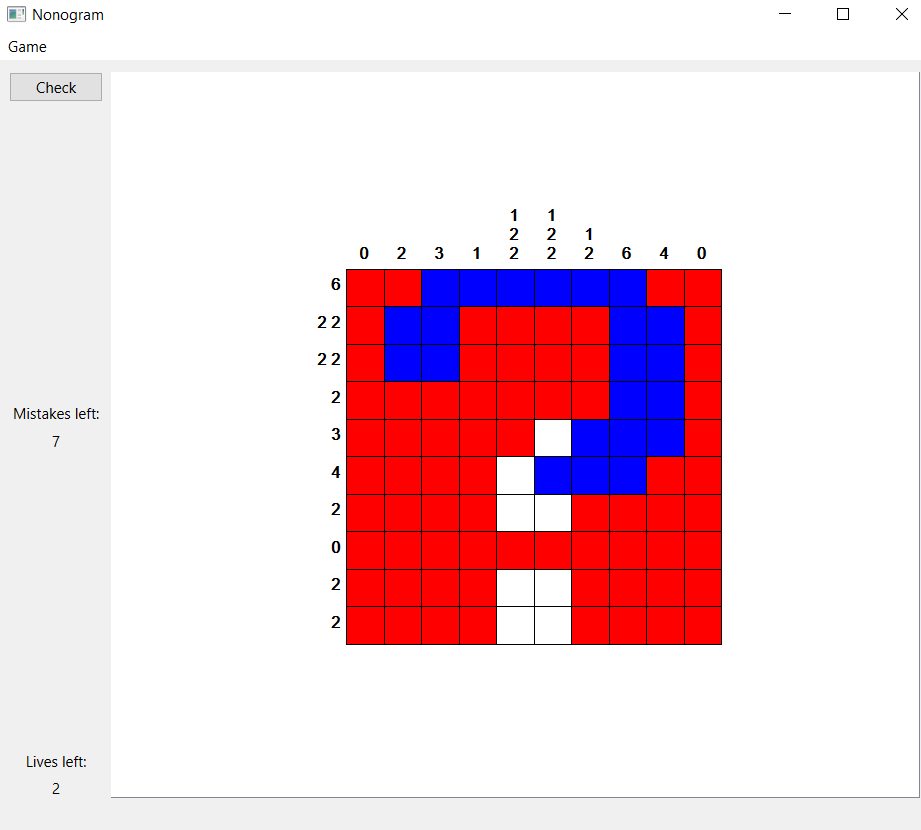

# Nonogram

Simple Nonogram game written in Qt using custom model for Nonogram puzzles data.

### Rules
Nonogram is a simple game which goal is to create picture following descriptions of rows and columns.
Use LMB to paint tile blue when you think it should be colored and RMB to paint it red when you are certain that tile will be empty.
Press check button to see your score. Have fun!
#### Player can solve puzzles from 3 themes: 
- Animals 
- Vechicles 
- Items 
#### Of 3 different sizes:
- 5x5
- 10x10
- 15x15

